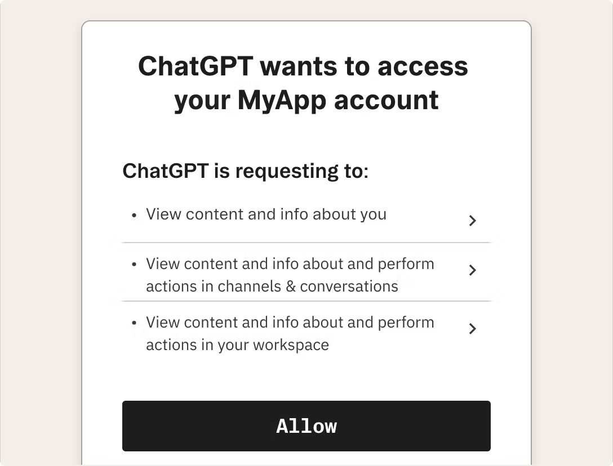

# Stytch B2B Connected Apps Demo



## Getting Started

The full Connected Apps guide can be found [here](https://stytch.com/docs/b2b/guides/connected-apps/getting-started). 
This repository shows some common patterns with Connected Apps in a B2B Context:
- Organization Discovery, Login, and Member Management
- OAuth Consent Flow
- Exposing external API endpoints protected by Stytch-powered OAuth 

#### Download the Repository
```bash
git clone https://https://github.com/stytchauth/stytch-connected-apps-b2b-demo.git
cd stytch-connected-apps-b2b-demo
nvm use # We recommend NVM for managing your node versions
npm install
```

#### Get API Keys

Sign up for an account at https://stytch.com/dashboard

Next, create a `.env.local` file in the root directory. The following environment variables need to be configured:
```.env
# Stytch credentials
NEXT_PUBLIC_STYTCH_PUBLIC_TOKEN=<your-stytch-project-id>
STYTCH_PROJECT_ID=<your-stytch-project-id>
STYTCH_SECRET=<your-stytch-secret>
```

Finally, start the application
```bash
npm run dev
```

Open [http://localhost:3000](http://localhost:3000) with your browser to see the result.
